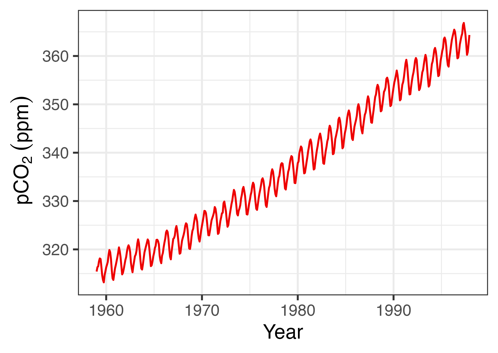

layout: true
  
<div class="my-footer"><span>Qiao-Guo Tan/CEE/XMU | tanqg@xmu.edu.cn | 2025-Feb-20   
&emsp;&emsp;&emsp;&emsp;&emsp;&emsp;&emsp;&emsp;&emsp;&emsp;&emsp;&emsp;&emsp;
&emsp;&emsp;&emsp;&emsp;&emsp;&emsp;&emsp;&emsp;&emsp;&emsp;&emsp;&emsp;&emsp;
</span></div> 

---
## 目录
#### 1. R可当计算器用
#### 2. 变量命名与赋值
#### 3. 数据类型与强制转化
#### 4. 缺失值和无穷大
#### 5. 向量生成与运算
#### 6. 矩阵生成
#### 7. 数据框生成与操作
#### 8. 读取与保存数据框
#### 9. 作图与保存


---

## 1. R可当计算器用

```{r comment='#'}

(1 + 2 * 4)/3 - 1.3  

100^0.5 #100的0.5次方根

log(2) #注意这是自然对数，与excel里的用法不一样

log10(2) #这才是以10为底的对数

```


---

```{r}
exp(1) #e是自然对数的底，e=2.718..., exp(1) = e^1；用于指数函数

sin(pi/2) # pi = 3.14159...圆周率

6.22e23 #科学计数法，6.22*10^23，注意这里e不是自然对数的底

abs(-10) #绝对值

```

???
```r 
options(digits=22)  
pi

```

---

### 取整：`round, floor, ceiling, trunc`

.pull-left[
`round()`函数取整原则：**四舍六入五成双**
```{r}
round(2.3)
round(2.6)
round(2.5)
round(3.5)
```
]

--
.pull-right[

```{r}
floor(2.6) #向下取整
ceiling(2.3) #向上取整
trunc(2.3)#取整数部分，对于正数，等价于floor
trunc(-2.6) #取整数部分，对于负数，等价于ceiling

```
]

---

### 保留有效数字：`round, signif`

原则：**四舍六入五成双**
```{r}
round(pi, 2) #保留2位小数
round(pi, 3) #保留3位小数

signif(pi,2) #保留2位有效数字
signif(pi,3) #保留3位有效数字
```


---

### 常用运算符

符号                 | 含义
---------------------|-------------
+, -, *, /, ˆ        | 算术运算符：加、减、乘、除、乘方
%/%, %%              | 商、余数
\>, =, <, <=, ==, != |关系运算符：大于等于、小于、小于等于、等于、不等于
 !, &, &#124;        |逻辑运算符：非、与、或
~                    |前者是后者的函数
<-, ->               |赋值符号 (可读作“得到”)
$                    |列表索引
:                    |创建序列


---

### 逻辑运算  

.pull-left[
```{r}
5 > 3 # 大于
5 == 3 #等于
1:5 != 3 #不等于
```
]

.pull-right[
```{r}
1:5 > 2 & 1:5 <5 # AND/与
1:5 <= 2 | 1:5 >=4 # OR/或

```
]

>注：`1：5`的是指包含“1，2，3，4，5”这5个自然数的向量

---

##  2. 变量赋值与命名

在R语言里，用符号".red[**`<-`**]"给变量赋值。它的功能和"**`=`**"虽几乎相同，但在有的场合有区别。
.pull-left[
```{r}
x1 = 12
x1

x2 <- 23
x2

y <- x1 + x2
y

x1 + x2 -> z 
z
```
]
.pull-right[
```{r}
data.frame(x = 1:3, y = 4:6)
data.frame(x <- 1:3, y <- 4:6)

```
]

---

##  变量命名规则  


.red[.large[
* 变量名只能是字母、数字、点（`.`）、下划线（`_`）的组合
]]

--

.large[
* 只能以字母或点开头；不能以数字、下划线开头
]

--

.red[.large[
* 对字母大小写敏感，`a`和`A`是不同的变量
]]

--

.large[
* 变量名不能含有空格：`x_1`, `x.1`都可以，但`x 1`不可以；推荐`x_1`形式的命名，理由是方便阅读，方便记忆
]

---

##  3. 数据类型  

.pull-left[
数据类型 | 含义
---------|-------------
integer  | 整数
numeric  | 实数
character| 字符
logical  | 逻辑值(`TRUE`或`FALSE`)

 
]

.pull-right[

* **用`class()`查看数据类型 **
```{r}

class(as.integer(1.2)) #将1.2转化为整数,并查看其类型


class(pi) # pi = 3.1415......
class("Xiamen")

class(c(TRUE,FALSE))

```
]

---

##  常用的数据结构

数据结构  |    说明
----------|------------------------------------------
vector    | 向量，元素可以是数值、字符串、逻辑值
factor    | 因子，水平，是离散的，以整数vector形式储存，映射到字符串上
matrix    | 矩阵，所有元素的类型(numeric, character等)需一致
data frame| 数据框，和matrix类似，但每列的类型可以不一致
list      | 清单，与vector类似，但每个元素的类型可以不一致，且可以是任何数据类型（例如numeric,data frame, list...)


---

## 数据类型强制转化 


.pull-left[
* 强制转化为数值`as.numeric()`
```{r}
t_1 <- c("1", "2", "3.4") #字符，无法进行计算
t_1
class(t_1)
t_2 <- as.numeric(t_1) #转化为数值，就可以计算了
t_2
class(t_2)
```
]

--
.pull-right[
* 强制转化为因子`as.factor()`
```{r}
t_3 <- as.factor(t_2) #数值转化为因子，非常有用的功能，以后详述
t_3
class(t_3)
```
]


---

# 4. 缺失值（`NA`）和无穷大（`Inf`）

实验数据经常会有缺失值，缺失值的处理对于数据分析非常重要。
.pull-left[
* 用`is.na()`判断是否为缺失值
```{r}
v0 <- c(1, 3, 4, NA) #第4个数缺失  
v0

is.na(v0) #判断是否有缺失值
v0[is.na(v0)] <- 0 #将缺失值替换为0
v0
```
]

--

.pull-right[
* 用`is.infinite()`判断是否为无穷大
```{r}
logv0 <- log(v0) #对数据进行自然对数转化，产生了负无穷大值（-Inf）
logv0
is.infinite(logv0) # 检查是否有无穷大，包括Inf和-Inf

logv0[is.infinite(logv0)] <- NA #将无穷大替换为缺失值NA
logv0

```
]

---

## 5. 向量（vector）

**用函数`c( )`生成向量**  

>"c"的含义:
>1. combine  
>2. concatenate [kɒn'kætɪneɪt] vt.把 （一系列事件、事情等）联系起来  

--

.pull-left[
* **数值向量**  

```{r}
v1 <- c(1.4, 3, 10.9, -7)
v1
```

* **字符向量**  

```{r}
v2 <- c("apple","organge","banana")
v2
```
]

--
.pull-right[

* **逻辑值向量**  

```{r}
v3 <- c(TRUE,FALSE,TRUE,FALSE)
v3
```
]


---

**用 `seq()`生成等差序列**  

```{r sequence}
seq(from = 10, to = 100, by = 10) 

```
--
from是第一个值，to是最后一个值，by是相邻两个数的间隔值。  
可以简略成(默认第1个数赋给`from`，第2个数赋给`to`，第3个数赋给`by`) :
```{r}
seq(10, 100, 10)

```
--

**怎么使用`seq()`函数？--查看帮助信息。**

执行代码.large[`?seq`]， 你会在Help栏看到如下信息:

> Usage  
>seq(...)  
>Default S3 method:  
>seq(from = 1, to = 1, by = ((to - from)/(length.out - 1)),
>    length.out = NULL, along.with = NULL, ...)  

--
  
耐心读一读，你可以看懂。  

---

**读懂之后，你还可以这么使用`seq()`：**

```{r}
seq(10, 100, length.out = 19)
```
`length.out`是数列的长度

```{r}
v2 <- seq(10, 100, length.out = 19)
v2[12]
```

---

**用`:`符号生成连续自然数序列**

```{r}
1:10
v3 <- 20:30
v3
```

---

**用`rep()`重复元素，生成向量**
.pull-left[
```{r}
rep(8, 5)
rep("ha", 6)
```
]

--

.pull-right[
```{r}
rep(1:3, 2)
rep(1:3, each = 3)
rep(1:3, each = 3, times=2)

```
]

这个功能在自动填充数据框时非常有用，例如，填充treatment，replicate编号。

---

### 向量信息提取与运算  
```{r message = F, error = T}
v1 <- c(1.4, 3, 10.9, -7)
v1[3] # 引用第3个元素
v1 + 10 # 每个元素均加10
v1 * 10 # 每个元素均乘以10
v1^2 #每个元素均求平方
```


---

### 针对向量的统计运算

.pull-left[
```{r }
v4 <- seq(60, 100, 5)
v4
summary(v4) 
mean(v4) #算术平均值
median(v4) #中位数

```
]

--

.pull-right[
```{r}
sd(v4) # 标准差
min(v4) # 最小值
max(v4) # 最大值
range(v4) #范围：最小值～最大值
```
]


---

## 6. 矩阵（matrix）

**用`matrix()`函数生成一个矩阵**

```{r}
m1 <- matrix(1:18, nrow=3, ncol=6)
m1

```
--
默认按列排元素，可用`byrow`更改为按行排
```{r}
m2 <- matrix(1:18, nrow=3, ncol=6, byrow=T)
m2
```

---

## 7. 数据框（data frame）

**用`data.frame()`函数生成一个数据框**

数据框储存以下信息：学生姓名、性别、考试分数
```{r}
student <- c("Tom", "Jack", "Mingming", "Alice", "Feifei")
sex <- c("Male", "Male", "Male", "Female", "Female")
score <- c(83, 72, 80, 92, 95)

data.frame(student, sex, score)

```

--

可将该数据框储存于变量**`d1`**中，也可以说给数据框取个名字叫**`d1`**
```{r}
d1 <- data.frame(student, sex, score)
```


---

### 引用`data.frame`中的信息  

引用**`d1`**数据框的**`student`**列有两种方法，一种是用名称，一种是用编号：
```{r}
d1$student 

d1[ , 1] #逗号前是行号，逗号后是列号

```

--
引用**`d1`**数据框第2个学生的成绩有两种方法，一种是用名称，一种是用编号:
```{r}
d1$score[2]
d1[2, 3] 
```

---

### 查看base R自带的数据

```{r}
data() #用此函数查看R自带的数据，以下是节选。
``` 
可以用这些数据来测试、交流你的统计、绘图代码。

数据名称 |简介
--------------|--------------------------
BOD           |Biochemical Oxygen Demand  
ChickWeight   |Weight versus age of chicks on different  
ToothGrowth   |The Effect of Vitamin C on Tooth Growth in Guinea Pigs
co2           |Mauna Loa Atmospheric CO2 Concentration
iris          |Edgar Anderson's Iris Data
mtcars        |Motor Trend Car Road Tests
npk           |Classical N, P, K Factorial Experiment
precip        |Annual Precipitation in US Cities
pressure      |Vapor Pressure of Mercury as a Function of Temperature
rivers        |Lengths of Major North American Rivers


---
  
### 查看数据框的常用命令
  
* 查看数据**`iris`**表头（默认前6行，可更改）  

```{r}
head(iris )
```

--
  
* 查看表尾（默认最后6行，可更改，此处改为4行）  

```{r}
tail(iris, 4)
```

---

* 查看数据框有哪些变量   

```{r}
names(iris) 
```
以上结果显示5个变量的名称，**每1列是1个变量**。

--

* 查看数据框的尺寸（dimension），即**行数**和**列数**
```{r}
dim(iris) 
```
结果显示150行，5列。

--

`length()`显示数据框的列数，即变量数；显示vector的长度，即元素数。
```{r}
length(iris) #5列
length(iris$Species) #150行
```


---

### 查看数据框的其他性质  

* **查看数据框的结构**
```{r}
str(iris)    

```
前4列均为**`numeric`**，最后一列为**`factor`**  


---

* **查看数据框的概要**

```{r}
summary(iris)
```
包含了每列的最小值、25%分位数、中位值、均值、75%分位数、最大值

--

* **查看`iris`这个对象（object）的类型**  

```{r}
class(iris) 
```
当然是**data.frame**类型。

---

### 合并数据框

```{r}
d1
```

--

```{r}
d2 <- data.frame(age = c(20, 19, 20, 21, 19))
d2
```

---

.pull-left[
* 合并列（**`column binding`**）
```{r}
cbind(d1, d2) 
```
]

--

.pull-right[
* 合并行（**`row binding`**）
```{r}
rbind(d1, d1)
```
]


---

## 8. 读入数据

四种方法：

代码 | 说明
-----|----------------------------
`d1 <- read.table("clipboard", head = T)` | 从剪贴板（ctrl+C）直接读取，适合于小数据框的快速操作
`d2 <- read.csv(file.choose())` | 弹出对话框，点击鼠标选取文件，读取`csv`格式的数据
`d3 <- read.csv("你的文件名.csv")` |从工作目录下直接读取`csv`格式的数据
`d4 <- read_excel("你的文件名.xlsx", sheet = 1)` | 直接读取`xlsx`文件中某个sheet（此处为sheet1）中的数据，需先加载`readxl`程序包


---

##  输出数据

`co2`是R自带的时间序列数据，此处将其转化为`data.frame`，用**`write.csv()`**函数将数据储存于名为“CO2_data.csv”的文件中。你可在工作文件夹下找到该文件。 
```{r error=TRUE}
d_CO2 <- data.frame(time = time(co2), CO2 = co2) 

write.csv(d_CO2, "CO2_data.csv")

```


---
## 准确分享数据

运行`dput()`，数据转化为纯文本格式输出，便于准确与他人分享
```{r}
dput(d_CO2)

```

---


## 9. Base R简单作图


.pull-left[
### 默认的`plot()`函数  

绘制散点图，可用于快速了解数据。
```r 
plot(x = d_CO2$time, y = d_CO2$CO2)
```
]

.pull-right[

```{r echo = FALSE, fig.width=8, fig.retina = 4}
plot(x = d_CO2$time, y = d_CO2$CO2)
```
]

---

### 修改为折线图
.pull-left[

```r
plot(x = d_CO2$time, y = d_CO2$CO2, type = "l")
```
]

.pull-right[
```{r echo = FALSE, fig.width=8, fig.retina = 4}
plot(x = d_CO2$time, y = d_CO2$CO2, type = "l")
```
]

---

### 修改颜色设置

.pull-left[
```r 
plot(x = d_CO2$time, y = d_CO2$CO2, type = "l", col = "red")
```
]

.pull-right[
```{r echo = FALSE, fig.width=8, fig.retina = 4}
plot(x = d_CO2$time, y = d_CO2$CO2, type = "l", col = "red")
```

]

---

### 修改坐标轴名称
.pull-left[

```r 
plot(x = d_CO2$time, y = d_CO2$CO2, type = "l", col = "red", xlab = "Year", ylab = expression(pCO[2]~"(ppm)"))

```
]

.pull-right[
```{r echo = FALSE, fig.width=8, fig.retina = 4}
plot(x = d_CO2$time, y = d_CO2$CO2, type = "l", col = "red", xlab = "Year", ylab = expression(pCO[2]~"(ppm)"))

```
]

---

## `ggplot`作图

先对`ggplot`绘图有个简单印象，下次课我们深入学习。

.pull-left[
```r
library(ggplot2) #ggplot绘图
ggplot(d_CO2, aes(time, CO2))+
  theme_bw()+
  geom_line(color = "red2")+
  labs(x = "Year",
       y = ~pCO[2]~(ppm))

ggsave("pCO2.png", width=342/90, height=243/90, dpi=600)
```
]

.pull-right[

```{r echo=F, out.width=342*1.2, out.height=243*1.2}


```
]


---

## 保存图片

### 第一种方法  
首先将图片赋值给变量**`p1`**。 

```r
library(ggplot2)

p1 <- ggplot(mpg, aes(displ, hwy))+
  geom_point()

```
然后调用**`png()`**作图设备作图，并记得随手用**`dev.off()`**关闭作图设备（否则不出图）。变量**`p1`**夹在以上两行代码之间。完成操作后，你就能在工作文件夹里找到名称为“myplot_1.png”的图了。

```r 
png("myplot_1.png", width=359/90*600, height=239/90*600, res=600)
p1
dev.off()
```


---

## 保存图片

### 第二种方法  

由于我们以后大多使用**`ggplot()`**作图，因此可以用**`ggplot2`**程序包中的**`ggsave()`**函数保存当前显示的图片（在RStudio右下面板中）。
```r 
library(ggplot2)
ggplot(mpg, aes(displ, hwy))+
  geom_point()

ggsave("myplot_2.png", width=359/90, height=239/90, dpi=600) #png格式，位图
ggsave("myplot_2.pdf", width=359/90, height=239/90) #pdf格式，矢量图
```
完成以上操作，你就能在工作文件夹里找到名称为“myplot_2.png”“myplot_2.pdf”的图了。

>如何设置合适的**`width`**和**`height`**?  
>需要一些技巧（见下页）和审美能力。

---
## 保存图片 
### 如何设置合适的**`width`**和**`height`**?  
1. 在RStudio的图片窗格中，单击“Zoom”，将绘图缩放到你满意的大小和纵横比;  

2. 在图上单击右键，选择“Copy Image  Address”，将地址粘贴到某处，即可获得地址中的宽度（www）和高度（hhh）信息;

3. 将宽度和高度信息填入`ggsave`，保存图片。注意除以90，转换表示尺寸的像素数和inch单位。 
```r
ggsave("plot.png", width = www/90, height = hhh/90, dpi = 900) 
ggsave("plot.pdf", width = www/90, height = hhh/90)
```


---
## 推荐阅读
Crawley MJ. The R Book. 2nd ed. Chapter 2. Essentials of the R Language.pp 12-136.
(有点枯燥，至少读1/3，读不完的之后的学习过程中还可以再回过头读。)


